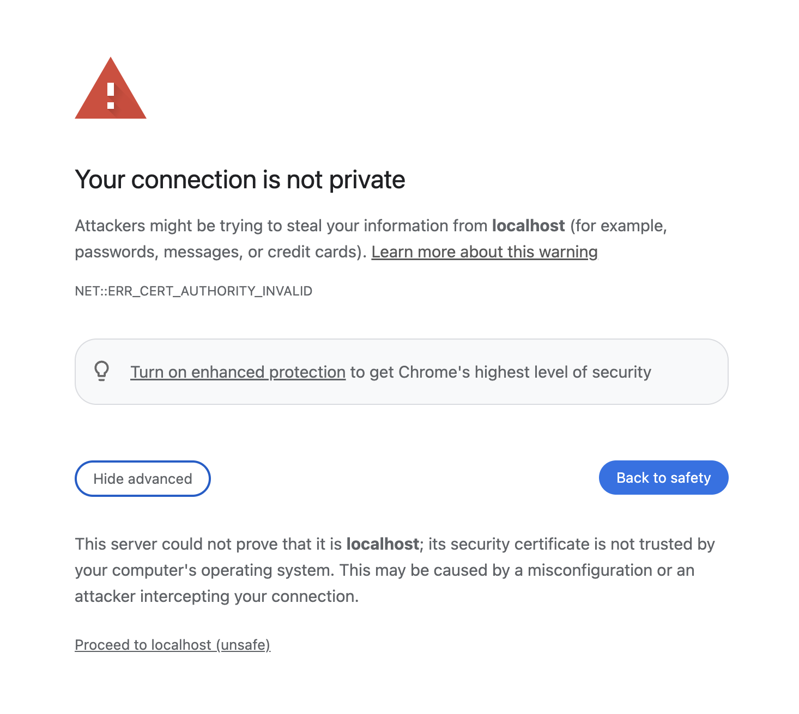

# Signalsmith Stretch: Web

### Demo

Per the [MDN docs](https://developer.mozilla.org/en-US/docs/Web/API/Worklet/addModule), the Worklet `addModule()` will only work if it's being served over HTTPS. For local development, a simple HTTPS server is included. To run this, use `make server`.

Once your server is started, navigate to https://localhost:8081/demo/. Your browser may show you a warning about your connection not being private, due to the certificate that was generated. You can click `Advanced`, then `Proceed to localhost (unsafe)` to view the demo.

